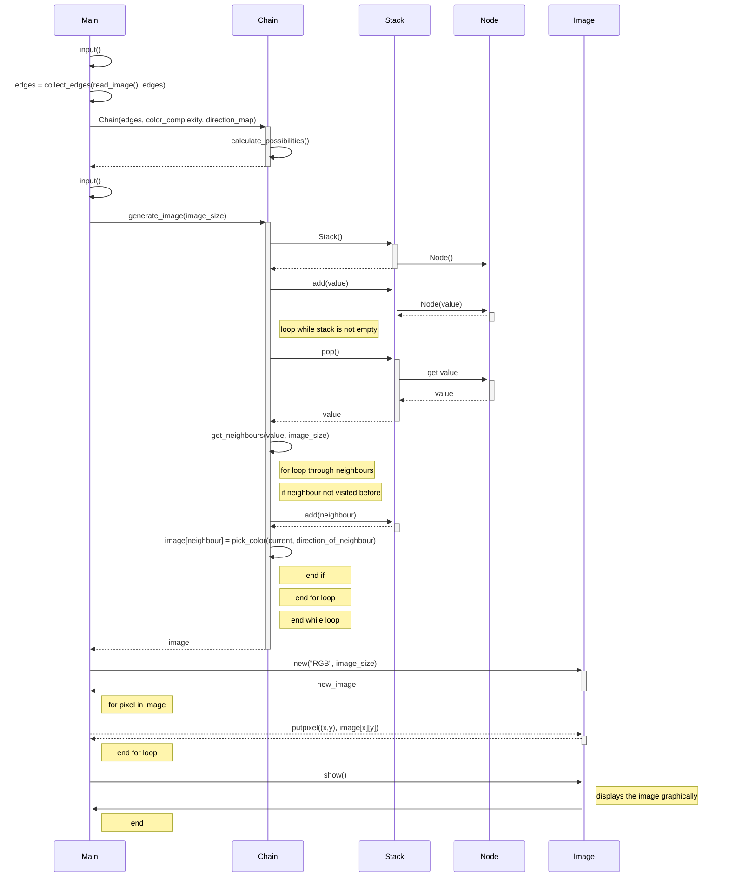

The program has the following structure when not using trie:  

Python's Random class is used in the depth-first traversal for shuffling the order of neighbouring nodes as well as selecting colors based on probabilities.

PIL Image and os are used for managing image files.

# Time Complexity
The code is based on the following pseudocode:  
[https://jonnoftw.github.io/2017/01/18/markov-chain-image-generation](https://jonnoftw.github.io/2017/01/18/markov-chain-image-generation)  

The complexity of my code follows

## Reading an image and training the chain
O(n \* k) | n is the number of pixels in the image and k is the number of neighbours to take into account (8  or 4 in my program). 

If trie is not used a n \* k \* n table is generated and filled. | n is the number of unique colors and k is the number of directions to consider.
This table has the time complexity O(n \* k \* n) when generated. This means the total complexity of reading an image and storing data in the markov chain is:  
* O(n \* k + n \* k \* n) = O(n2 \* k)

When using a trie the trie is filled in parallel to the image being read. This means that reading the image and training the trie has the total complexity O(n \* k).

When not using trie: O(n2 \* k)  
When using trie: O(n \* k)  

## Traversal of the image and picking the colors
Picking the colors is done by traversing the image with DFS and selecting the next color randomly from the specific color's frequency list.
The complexity of DFS: O((w*h)*k) | where w is the width of the image, h is the height of the image and k is the number of directions to consider (4 or 8).  

### When not using the trie
The complexity of selecting the color: O(c) | where c is the number of colors to select from.  
* Best, worst and average case for c: c = n | Where n is the number of unique colors in the image.

### When using the trie
The complexity of selecting the color: O(c) | where c is the number of colors to select from.  
* Best case for c: c = 1  
* Worst case for c: c = n: | Where n is the number of unique colors in the image.
* Average case for c: $$ {{1 + 2 + 3 + ... + n } \over n} = {{n+1} \over 2}$$

Both when using a trie and when not, the worst case is the same, however the best and  average cases are not. 

# Space Complexity
My code needs to store the color values of the original image.
O(n), where n is the number of different colors. In normal pictures n is really large number, which when not using the trie causes the memory to overflow. Due to this it is recommended to round the RGB values to the nearest at the very least 50.  
Example: (255, 111, 15) becomes (250, 100, 0).  
I've found that the colors are still close enough to the original image that it doesnt matter. The space complexity can be further reduced by increasing the value to round to, and more detail can be achieved by decreasing it.  

When using trie, the memory leak does not happen, as the trie has a much smaller average space complexity. The worst case is however the same for the trie, but to trigger the memory leak the input images would either have to be really large or many, in order to even contain the necessary amount of color data to hit the memory cap.

When not using the trie the chain has a space complexity of O(q \* k \* q), where q is the rounded down number of colors and k is the number of neighbours to consider (8 or 4 in my program). The reason for k being part of it is because I also keep track of the directional relation between the two colors.  

Example: If red pixels are allways beneath blue pixels in the original. In the generated picture, red is mostly beneath blue. It won't allways hold, as it depends on what order the pixels are generated.

When using trie the space complexity is drastically smaller. The trie only stores the frequency of a pair of colors, if it is larger than 0. Because there are usually many colors that are never next to eachother in every direction. This means that when storing the data into a table, there are many cells in the table that are unnecessary because the probability value they contain is 0. The trie on the other hand stores only the relevant data. 

Trie space complexity: O(q \* p) | where q is the rounded color complexity for the image and p is the number of unique color pairs for each direction.

p worst case : k*q | where k is the number of directions to consider (8 or 4)
This means that the tire features the same worst case complexity as the table, however trie features better best and average case complexity.