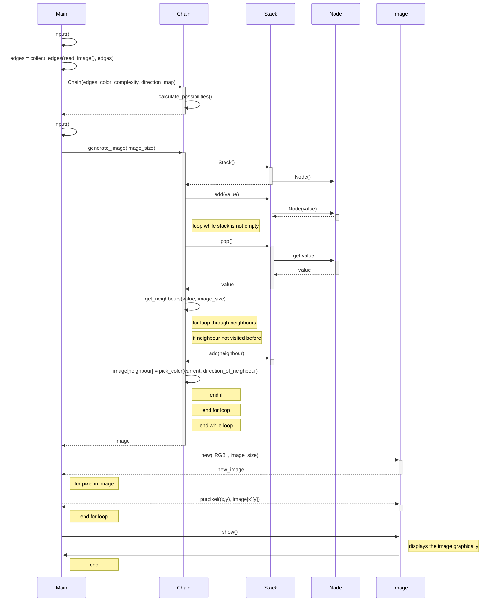

The program has the following structure:  

Python's Random class is used in the depth-first traversal for shuffling the order of neighbouring nodes as well as selecting colors based on probabilities.

PIL Image and os are used for managing image files.

## Time Complexity
The code is based on the following pseudocode:  
[https://jonnoftw.github.io/2017/01/18/markov-chain-image-generation](https://jonnoftw.github.io/2017/01/18/markov-chain-image-generation)  

The complexity of my code follows

### Reading an image and training the chain
O(n*k) where n is the number of pixels in the image and k is the number of neighbours to take into account (8 in my program). 
The training happens in parallel with the reading and has the same complexity, so no additional time complexity.  

The reading complexity could be improved for larger images by limiting the number of pixels to check, and checking pixels with a specific distance between to cover the whole image evenly.

### Generating the image
O((w*h)*k) where w is the width of the image to generate and h is the height of the image to generate. k is still the number of neighbours the current pixel has (the user gets to choose between a maximum of 4 or 8 neighbours per node).  

There isn't a whole lot to do to improve the complexity here other than decreasing the number of neighbours to consider. But that means also loosing detail in the generated image.

## Space Complexity
My code needs to store the color values of the original image.
O(n), where n is the number of different colors. In normal pictures n is really large number, which causes the memory to overflow. Due to this I round the RGB values to the nearest 50 and ditch the alpha channel.  
Example: (255, 111, 15, some_alpha_value) becomes (250, 100, 0).  
I've found that the colors are still close enough to the original image that it doesnt matter. The space complexity can be further reduced by increasing the value to round to, and more detail can be achieved by decreasing it.

The chain has a space complexity of O(q*k*q) where q is the rounded down number of colors and k is the number of neighbours to consider (8 in my program). The reason for k being part of it is because I also keep track of the directional relation between the two colors.  
Example: If red pixels are allways beneath blue pixels in the original. In the generated picture, red is mostly beneath blue. It won't allways hold, as it depends on what order the pixels are generated.