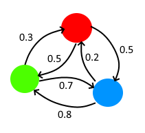

Language: Python  
Other languages I know: C++  
Documentation language: English  
Degree programme: Tietojenkäsittelyntieteen kandidaatti (TKT)  

## Idea  
The idea is to utilize markov chains to draw digital pictures. 
A markov chain will be created from a set of pictures. Each node in the chain will have a specific color assigned to it, and will be connected with directed weighted edges.
The weights of the edges will represent the probability that the child node will be the next color after the color of the parent node.  

Example:  
  

The images will be generated from left to right, one row at a time. This means that either one chain per row or one per image would need be generated. One chain per row might lead to more detailed images.

More detail could also be achieved by basing the probabilities out of more data. For example: the colors of both the previous pixel and the pixel on the row above or maybe a larger segment of previous pixels. 

## Input and complexity
The input would be a collection of square images of the same size. The images would be broken down into rows and the frequenzy of adjecent colors will be stored to generate the markov chain.  

Because each image will be itterated through pixel by pixel, the complexity for generating the markov chain will be: O(n*k^2), where n is the number of images and k is the number of rows.

As the individual operations on the pixels can be performed in constant time, the complexity of the image generation would be: O(k^2), where k is the number of rows in the image.

## Sources  
[Markov Chains Clearly Explained! Part-1 - by Normalized Nerd on Youtube](https://www.youtube.com/watch?v=i3AkTO9HLXo&feature=share&si=ELPmzJkDCLju2KnD5oyZMQ)  
 