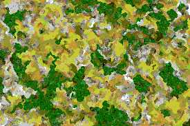
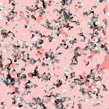
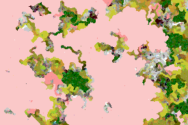

This week I changed the algorithm to follow the pseudocode which can be found at the following webpage:  [https://jonnoftw.github.io/2017/01/18/markov-chain-image-generation](https://jonnoftw.github.io/2017/01/18/markov-chain-image-generation)  
This algorithm works similarly to the one I used previously.  
1. First it goes through each pixel in the source image. It pairs up adjecent colors in the image, which are then turned into edges in the markov chain. The weight of the edges are ate first the frequency of said pair of colors in the source image. When the Chain is fully generated, the weights are changed to represent the probability of one color being next to another.  
2. When the chain is complete, it start generating the new image. The new image is the same size as the last image. A random pixel is selected as starting point in the new image. The starting point recieves a random color from the markov chain, after which the image is traversed using DFS. For each pixel all the noncolored neighbours get colored, by randomly selecting a color weighted by the probabilities in the markov chain. 

Example: If the current color is red, the weights of the next color are found like this: markov_chain[red] = [0.2, 0.6, 0.1, 0.1], where markov_chain is the adjacency list for the edges in the markov chain and the list of decimals are the probability values.

3. When a neighbour has been colored, it is added to a stack. The next pixel is then selected from the top of the stack. This means the last neighbour to be colored will be the next pixel to get its neighbours colored. If a neighbour is already colored it will be ignored, which means this will continue until all pixels in the image are colored. 

## Example images
### Input

### Output
  

### Input

### Output
  

### Input
Both previous inputs.
### Output

## Features to be added.
This algorithm is good at generating images of the same color palette and color distribution as the source image. But it can be improved to also recreate some patterns. As stated by the author of the previously linked github project on the following StackExchange thread:
[https://scicomp.stackexchange.com/questions/22022/markov-chain-image-generators](https://scicomp.stackexchange.com/questions/22022/markov-chain-image-generators)  
The algorithm can be improved to take all 8 surrounding neighbours into account (right now it only takes the 4 direct neighbours), as well as taking the directions of the neighbours into account.  

Example: the probability of a blue pixel being next to a red pixel is the following: markov_chain[red][blue] = [0.2, 0, 0.6, 0.5], where each decimal in the list represents a different direction from the red pixel.

This week I learned how to use Pillow for image input and output, as well as how to generate image files. 

One problem I have at the moment is the efficiency of the algorithm. Because it is innefficient, it has to compress the colors of the source image to make the program work in an acceplable time. I will need to optimize the algorithm to be able to handle a wider range of colors at once and also make it work on larger images. At the moment HD quality images and larger take a very long time to process.

Hours used this week: 6